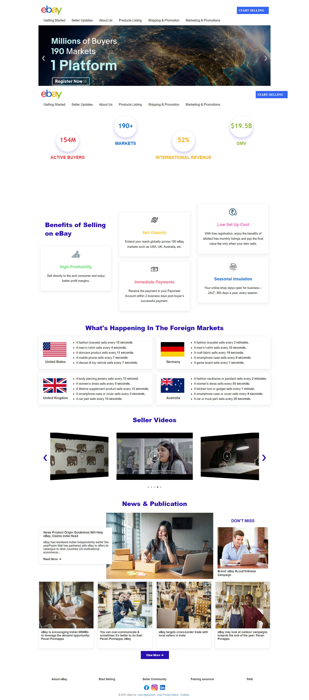
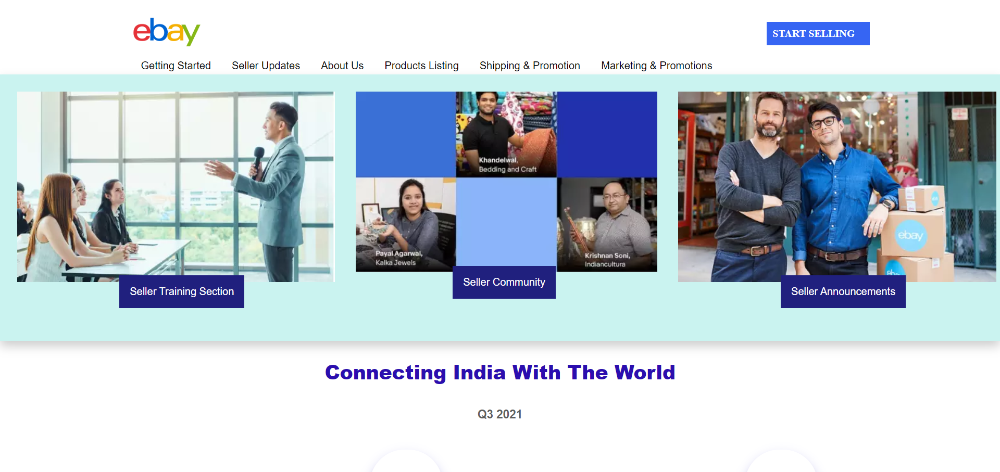
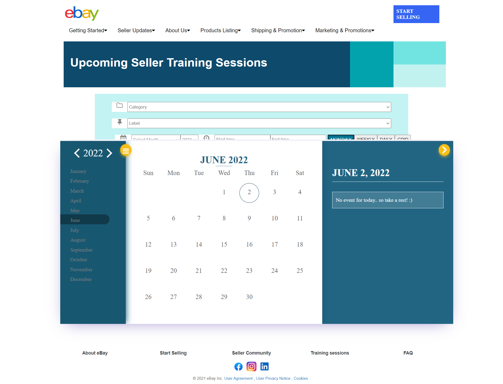
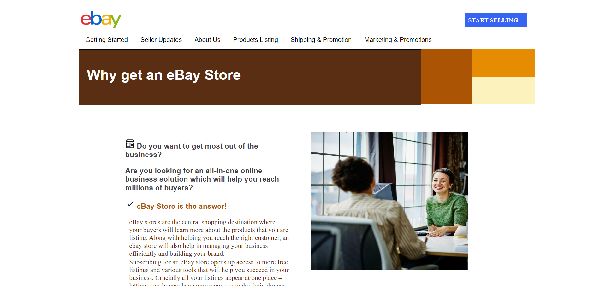
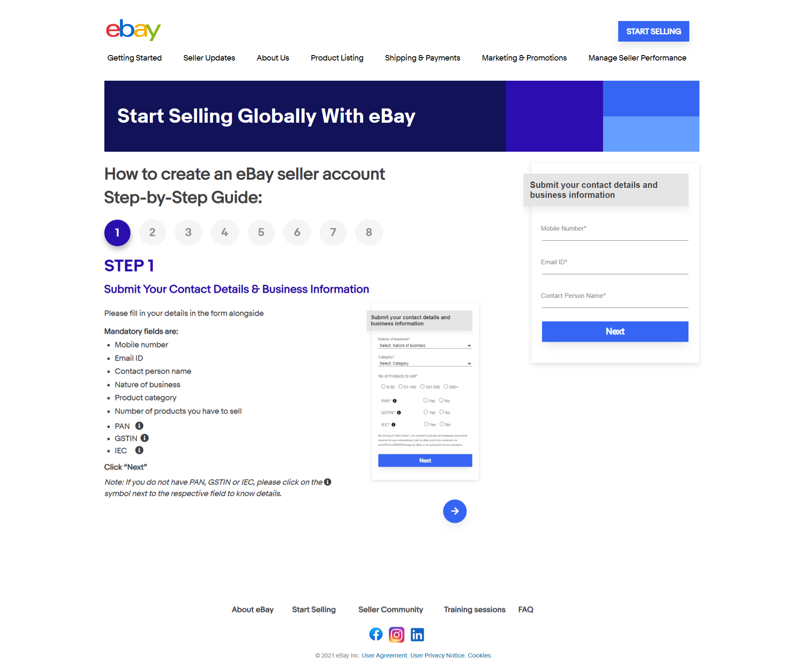

# Clone of ebay.in

Established in 1995, eBay, the world’s biggest online marketplace created a powerful platform for selling goods and services by passionate individuals and businesses. eBay enables trade on a local, national, and international basis with customized sites in markets around the globe, ensuring global e-commerce for an ever-growing online community.

- [Click here](https://ebay-clone-by-arshad-khan.netlify.app/) to preview this project.

**Client:** [ebay.in](https://sellglobal.ebay.in/seller-center/) 

## Credits

- Images : [ebay.in](https://sellglobal.ebay.in/seller-center/)
- Content : [ebay.in](https://sellglobal.ebay.in/seller-center/)
- CSS Library: [Bootstrap](https://getbootstrap.com/) 

## 🛠 Tech Stack
- HTML 
- CSS 3
- JavaScript
- Github

## Features
- Media query for All Size Screen.
- Navbars with its Pop-Ups.
- Sliding Video
- Review page for different categories.
- Detailed product preview page
- Payment Page.

## Screenshots of our Project for Overview

### 1. Landing page

### 2. Navbar Popup

### 3. Event Setting

### 4. Why get an ebay store page

### 5. Registration page

## Challenges
- The approach of the project was that we saw that are 6 navbars that are attached to the homepage. So that we have dived the project into parts.
- Another problem was to merge all of the files in a proper sequence which was again a difficult task for us because while merging and connecting all the pages some of the pages had the same name, and while running the site it was redirecting to some other pages so it was difficult too.
- Another issue is about adjusting the Navbar is one of the difficult things, on the home page, we had added the sliding video part which has taken a long time.
- The popup part for the Navbar is the major task for us because when hovering on the Navbar we should get the popup in the correct way.

## 🔗 Authors
Click the name to visit their Github Profile
- [MD Arshad Khan](https://github.com/mdarshadkhan1998)

## Support

For support, email - [mdarshadkhan1998@gmail.com](mdarshadkhan1998@gmail.com)
